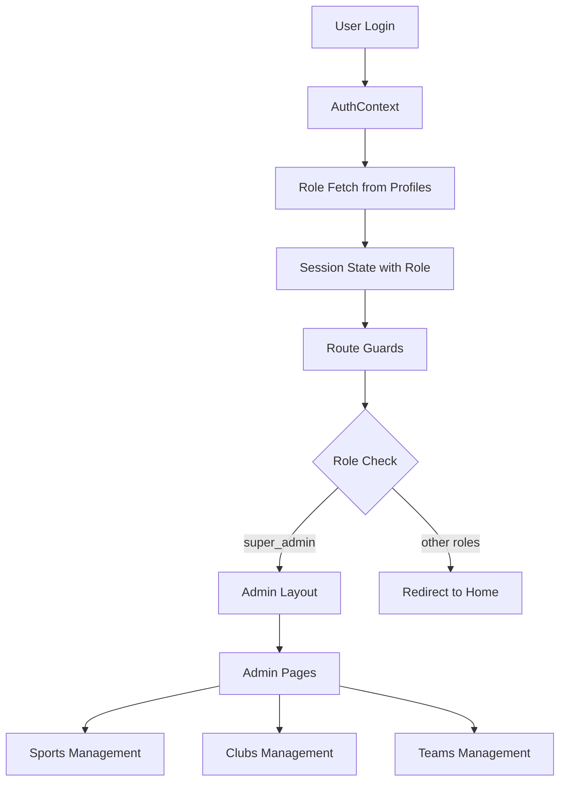

# Design Document

## Overview

The admin role gating system will extend the existing authentication architecture to provide role-based access control for administrative functions. The system leverages the existing AuthContext and Supabase setup, adding session management with role information, route protection mechanisms, and a dedicated admin interface for managing sports, clubs, and teams.

The design builds upon the current React Router setup and existing UI components, ensuring consistency with the application's design system while providing secure access control at multiple levels.

## Architecture

### High-Level Architecture



### Component Hierarchy

```
App
├── AuthProvider (Enhanced)
│   └── SessionProvider (New)
├── BrowserRouter
└── Routes
    ├── Public Routes (Login, Signup)
    ├── Protected Routes (Dashboard, etc.)
    └── Admin Routes (Protected by AdminGuard)
        └── AdminLayout
            ├── AdminSidebar
            └── Admin Pages
                ├── SportsPage
                ├── ClubsPage
                └── TeamsPage
```

## Components and Interfaces

### 1. Enhanced Session Management

#### SessionProvider Context
- **Location**: `src/store/session.tsx`
- **Purpose**: Centralized session and role management
- **State Structure**:
```typescript
interface SessionState {
  user: User | null
  role: AppRole | null
  loading: boolean
}
```

#### Integration with AuthContext
The existing AuthContext already includes role management functionality. We will enhance it to ensure proper session state management and add the SessionProvider as an alias/wrapper for consistency with the requirements.

### 2. Type Definitions

#### Database Types
- **Location**: `src/types/db.ts`
- **Content**:
```typescript
export type AppRole = 'super_admin' | 'admin' | 'coach' | 'player'

export interface Profile {
  id: string
  email: string | null
  display_name: string | null
  role: AppRole
  created_at: string
}

export interface Sport {
  id: string
  name: string
  created_at: string
}

export interface Club {
  id: string
  name: string
  sport_id: string
  created_at: string
  sports?: { name: string }
}

export interface Team {
  id: string
  name: string
  club_id: string
  created_at: string
  clubs?: { name: string }
}
```

### 3. Route Protection

#### AdminGuard Component
- **Location**: `src/components/RouteGuards/AdminGuard.tsx`
- **Functionality**:
  - Check loading state and show spinner
  - Verify user role is 'super_admin'
  - Redirect unauthorized users to home page
  - Render children for authorized users

#### Route Structure
```typescript
// Enhanced route structure in main.tsx
<Routes>
  {/* Existing routes */}
  <Route path="/admin" element={<AdminGuard><AdminLayout /></AdminGuard>}>
    <Route index element={<Navigate to="/admin/sports" replace />} />
    <Route path="sports" element={<SportsPage />} />
    <Route path="clubs" element={<ClubsPage />} />
    <Route path="teams" element={<TeamsPage />} />
  </Route>
</Routes>
```

### 4. Admin Interface

#### AdminLayout Component
- **Location**: `src/layouts/AdminLayout.tsx`
- **Features**:
  - Dedicated admin sidebar with navigation
  - Consistent styling with existing AppShell
  - Responsive design
  - Outlet for nested admin pages

#### Enhanced Sidebar Navigation
- **Location**: Update existing `src/components/layout/Sidebar.tsx`
- **Changes**:
  - Conditionally show Admin section based on role
  - Update admin navigation items to match new structure
  - Maintain existing UI patterns and styling

### 5. Admin Pages

#### SportsPage Component
- **Location**: `src/pages/admin/SportsPage.tsx`
- **Data Fetching**:
```typescript
const { data: sports } = await supabase
  .from('sports')
  .select('id, name, created_at')
  .order('created_at', { ascending: false })
  .limit(25)
```

#### ClubsPage Component
- **Location**: `src/pages/admin/ClubsPage.tsx`
- **Data Fetching**:
```typescript
const { data: clubs } = await supabase
  .from('clubs')
  .select('id, name, created_at, sport_id, sports(name)')
  .order('created_at', { ascending: false })
  .limit(25)
```

#### TeamsPage Component
- **Location**: `src/pages/admin/TeamsPage.tsx`
- **Data Fetching**:
```typescript
const { data: teams } = await supabase
  .from('teams')
  .select('id, name, created_at, club_id, clubs(name)')
  .order('created_at', { ascending: false })
  .limit(25)
```

## Data Models

### Database Schema Integration

The system integrates with existing database schema:

- **profiles table**: Contains user roles (already implemented)
- **sports table**: Core sports data (assumed to exist)
- **clubs table**: Club information with sport relationships
- **teams table**: Team information with club relationships

### Data Flow

1. **Authentication**: User logs in through existing auth flow
2. **Role Fetching**: AuthContext fetches role from profiles table
3. **Session Management**: Role stored in context state
4. **Route Protection**: Guards check role before rendering
5. **Data Fetching**: Admin pages fetch data with proper error handling
6. **UI Rendering**: Data displayed using existing UI components

## Error Handling

### Error Handling Strategy

1. **Authentication Errors**: Handled by existing AuthContext
2. **Role Fetching Errors**: Graceful degradation to no admin access
3. **Data Fetching Errors**: User-friendly error messages with retry options
4. **Network Errors**: Loading states and error boundaries
5. **Permission Errors**: Automatic redirection to safe routes

### Error UI Components

- Loading spinners for async operations
- Error messages using existing toast/notification system
- Empty states for no data scenarios
- Fallback UI for failed data fetches

## Testing Strategy

### Unit Testing

1. **SessionProvider**: Test role fetching and state management
2. **AdminGuard**: Test role-based access control logic
3. **Admin Pages**: Test data fetching and error handling
4. **Route Protection**: Test unauthorized access scenarios

### Integration Testing

1. **Authentication Flow**: Test login → role fetch → admin access
2. **Navigation**: Test admin menu visibility and routing
3. **Data Flow**: Test end-to-end data fetching and display
4. **Error Scenarios**: Test network failures and permission errors

### Manual Testing Scenarios

1. **Super Admin Flow**: Login → see admin menu → navigate to all admin pages
2. **Non-Admin Flow**: Login → no admin menu → manual URL access blocked
3. **Logout Flow**: Admin menu disappears → session cleared
4. **Loading States**: Proper loading indicators during async operations
5. **Error Handling**: Graceful error messages and recovery

## Security Considerations

### Client-Side Security

- Role-based UI hiding (defense in depth)
- Route-level protection with guards
- Automatic redirection for unauthorized access
- Session state validation

### Server-Side Security

- Database RLS policies (already implemented)
- Proper foreign key constraints
- API-level permission checks
- Secure role fetching with error handling

### Best Practices

- Never trust client-side role checks alone
- Always validate permissions on server
- Use TypeScript for type safety
- Implement proper error boundaries
- Log security-related events

## Performance Considerations

### Optimization Strategies

1. **Lazy Loading**: Admin pages loaded only when needed
2. **Caching**: Role information cached in context
3. **Pagination**: Limit data fetching to 25 items per page
4. **Efficient Queries**: Use Supabase joins where possible
5. **Loading States**: Prevent UI blocking during async operations

### Data Fetching Strategy

- Use React Query or SWR for caching (future enhancement)
- Implement proper loading and error states
- Fallback to separate queries if joins fail
- Optimize database queries with proper indexing

## Migration Strategy

### Implementation Phases

1. **Phase 1**: Create type definitions and session management
2. **Phase 2**: Implement route guards and admin layout
3. **Phase 3**: Create admin pages with data fetching
4. **Phase 4**: Update navigation and integrate with existing UI
5. **Phase 5**: Testing and refinement

### Backward Compatibility

- Existing routes and functionality remain unchanged
- AuthContext enhanced without breaking changes
- New admin features additive to existing system
- Graceful degradation for users without admin roles