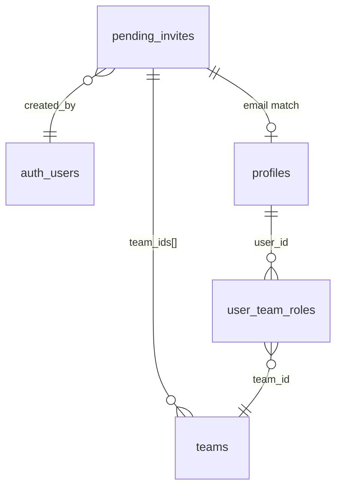

# Design Document

## Overview

The user invitation system enables SUPER_ADMIN users to invite coaches and admins to join teams through a streamlined process that bypasses email validation. The system generates one-time recovery links that can be shared through any communication channel, and automatically assigns roles and team memberships when invitees complete their registration.

The design follows a three-tier architecture:
1. **Database Layer**: New `pending_invites` table with RLS policies and automatic trigger processing
2. **API Layer**: Supabase Edge Function for invitation creation and link generation
3. **Frontend Layer**: React components for invitation management and status tracking

## Architecture

### Database Schema Extensions

#### New Table: `pending_invites`
```sql
create table public.pending_invites (
  id bigserial primary key,
  email text not null unique,
  role app_role not null check (role in ('coach','admin')),
  team_ids bigint[] not null default '{}',
  status text not null default 'pending' check (status in ('pending','accepted','canceled')),
  created_by uuid not null references auth.users(id),
  created_at timestamptz default now(),
  accepted_at timestamptz
);
```

#### Automatic Processing Trigger
A database trigger `trg_apply_pending_invite` executes after user creation in `auth.users` to:
- Match new users with pending invitations by email
- Create/update profiles with the specified role
- Assign users to teams via `user_team_roles`
- Mark invitations as accepted

### API Architecture

#### Edge Function: `invite-user`
**Endpoint**: `/functions/v1/invite-user`
**Method**: POST
**Authentication**: Bearer token (SUPER_ADMIN required)

**Request Schema**:
```typescript
{
  email: string;
  display_name?: string;
  role: 'coach' | 'admin';
  teamIds: number[];
  redirectTo?: string;
}
```

**Response Schema**:
```typescript
{
  ok: boolean;
  action_link: string;
  error?: string;
}
```

**Processing Flow**:
1. Validate JWT and verify SUPER_ADMIN role
2. Check if user exists in auth.users
3. Create user if not exists (with email_confirm: true)
4. Generate recovery link using admin API
5. Upsert pending invitation record
6. Return action_link for sharing

### Frontend Architecture

#### Component Hierarchy
```
InviteUserPage
├── InviteUserForm
│   ├── EmailInput
│   ├── DisplayNameInput
│   ├── RoleSelect
│   ├── TeamMultiSelect
│   └── RedirectUrlInput
├── InvitationResult
│   ├── LinkDisplay
│   └── CopyButton
└── InvitationsList (optional)
    └── InvitationStatusTable
```

#### State Management
- Form state managed locally with React Hook Form
- Team data fetched via existing `services/teams.ts`
- Invitation creation via new `services/invites.ts`
- Success/error states managed with toast notifications

## Components and Interfaces

### Database Components

#### RLS Policies
```sql
-- SUPER_ADMIN full access
create policy "pi superadmin all" on public.pending_invites
  for all using (public.is_superadmin()) 
  with check (public.is_superadmin());

-- Creators can read their own invitations
create policy "pi owner read" on public.pending_invites
  for select using (created_by = auth.uid() or public.is_superadmin());
```

#### Trigger Function
```sql
create or replace function public.apply_pending_invite()
returns trigger language plpgsql security definer set search_path = public
```
- Matches users by email (case-insensitive)
- Creates/updates profiles with invitation role
- Assigns team memberships
- Updates invitation status

### API Components

#### Authentication Middleware
- JWT validation using Supabase service role
- Role verification against profiles table
- Error handling for unauthorized access

#### User Management
- Idempotent user creation
- Recovery link generation with custom redirect
- Invitation record management

### Frontend Components

#### InviteUserForm
**Props**: None (standalone page component)
**State**: 
- Form data (email, display_name, role, teamIds, redirectTo)
- Loading states
- Validation errors

**Validation Schema**:
```typescript
const inviteSchema = z.object({
  email: z.string().email(),
  display_name: z.string().min(2).max(100).optional(),
  role: z.enum(['coach', 'admin']),
  teamIds: z.array(z.number().int().positive()).min(1),
  redirectTo: z.string().url().optional()
});
```

#### TeamMultiSelect
**Props**: 
- `value: number[]`
- `onChange: (teamIds: number[]) => void`
- `sportFilter?: number`
- `clubFilter?: number`

**Features**:
- Hierarchical display (Sport > Club > Team)
- Search/filter functionality
- Multi-selection with checkboxes

#### InvitationResult
**Props**:
- `actionLink: string`
- `onClose: () => void`

**Features**:
- Copy to clipboard functionality
- QR code generation (optional)
- Social sharing buttons (optional)

## Data Models

### TypeScript Interfaces

```typescript
// Core invitation interface
export interface PendingInvite {
  id: number;
  email: string;
  role: 'coach' | 'admin';
  team_ids: number[];
  status: 'pending' | 'accepted' | 'canceled';
  created_by: string;
  created_at: string;
  accepted_at?: string;
}

// API request/response types
export interface InviteUserRequest {
  email: string;
  display_name?: string;
  role: 'coach' | 'admin';
  teamIds: number[];
  redirectTo?: string;
}

export interface InviteUserResponse {
  ok: boolean;
  action_link: string;
  error?: string;
}

// Form data type
export interface InviteFormData {
  email: string;
  display_name: string;
  role: 'coach' | 'admin';
  teamIds: number[];
  redirectTo: string;
}
```

### Database Relationships



## Error Handling

### Database Level
- Constraint violations (invalid roles, non-existent teams)
- Duplicate email handling in pending_invites
- Foreign key constraint errors
- Trigger execution failures

### API Level
- Authentication failures (invalid JWT, insufficient permissions)
- User creation failures (email already exists, invalid data)
- Link generation failures (Supabase API errors)
- Database operation failures

### Frontend Level
- Form validation errors (invalid email, empty team selection)
- Network request failures
- Clipboard API failures
- Loading state management

### Error Response Format
```typescript
interface ErrorResponse {
  ok: false;
  error: string;
  details?: string;
  code?: string;
}
```

## Testing Strategy

### Database Testing
- **Unit Tests**: Trigger function behavior with various scenarios
- **Integration Tests**: End-to-end invitation flow from creation to acceptance
- **Security Tests**: RLS policy enforcement
- **Edge Cases**: Duplicate emails, non-existent teams, invalid roles

### API Testing
- **Authentication Tests**: Valid/invalid JWT tokens, role verification
- **Functional Tests**: User creation, link generation, invitation storage
- **Error Handling Tests**: Invalid inputs, database failures, external API failures
- **Performance Tests**: Concurrent invitation creation

### Frontend Testing
- **Component Tests**: Form validation, user interactions, state management
- **Integration Tests**: API communication, error handling, success flows
- **E2E Tests**: Complete invitation workflow from form submission to link generation
- **Accessibility Tests**: Keyboard navigation, screen reader compatibility

### Test Data Management
- Mock team/club/sport data for consistent testing
- Test user accounts with different roles
- Cleanup procedures for test invitations
- Isolated test database for integration tests

## Security Considerations

### Authentication & Authorization
- JWT validation on all API endpoints
- Role-based access control (SUPER_ADMIN only)
- Row-level security on pending_invites table
- Secure trigger execution with elevated privileges

### Data Protection
- Email validation and sanitization
- SQL injection prevention through parameterized queries
- XSS prevention in frontend components
- Secure handling of recovery links

### Link Security
- One-time use recovery links
- Configurable expiration times
- Secure redirect URL validation
- HTTPS enforcement for production

## Performance Considerations

### Database Optimization
- Indexes on frequently queried columns (email, status, created_by)
- Efficient trigger implementation to minimize lock time
- Batch operations for multiple team assignments
- Connection pooling for Edge Functions

### Frontend Optimization
- Lazy loading of team data
- Debounced search in team selection
- Optimistic UI updates
- Efficient re-rendering with React.memo

### Caching Strategy
- Team data caching with invalidation
- User role caching in AuthContext
- Browser caching for static assets
- CDN caching for Edge Function responses