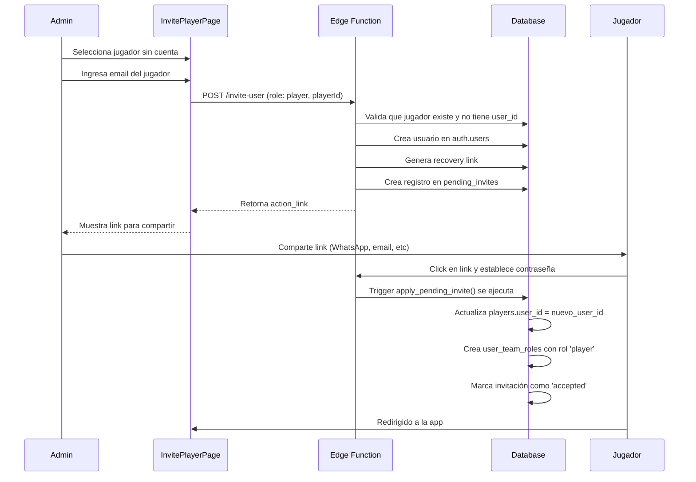

# Sistema de Invitación de Jugadores (Players)

## Resumen

Este documento describe la extensión del sistema de invitaciones para soportar la invitación de **jugadores (players)** con vinculación automática a sus registros en la tabla `players`.

## Diferencias con Invitaciones de Coach/Admin

| Aspecto | Coach/Admin | Player |
|---------|-------------|--------|
| **Equipos asignados** | Múltiples equipos | Un solo equipo (el del jugador) |
| **Vinculación** | Solo rol y equipos | Vinculación con registro de `players` |
| **Interfaz** | Formulario completo con multi-select | Formulario simplificado con selector de jugador |
| **Restricciones** | Pueden no tener jugador asociado | Deben tener un jugador existente |

## Arquitectura

### 1. Base de Datos

#### Cambios en la tabla `players`
```sql
-- Nueva columna para vincular jugador con usuario autenticado
alter table public.players 
add column user_id uuid references auth.users(id) on delete set null;

-- Índice para búsquedas rápidas
create index idx_players_user_id on public.players(user_id);

-- Constraint único: un usuario solo puede estar vinculado a un jugador
alter table public.players 
add constraint uniq_players_user_id unique (user_id);
```

#### Cambios en la tabla `pending_invites`
```sql
-- Extender roles permitidos para incluir 'player'
alter table public.pending_invites 
add constraint pending_invites_role_check 
check (role in ('coach', 'admin', 'player'));

-- Nueva columna para vincular invitación con jugador específico
alter table public.pending_invites 
add column player_id bigint references public.players(id) on delete cascade;
```

#### Trigger actualizado
El trigger `apply_pending_invite()` ahora maneja dos flujos:

**Para coaches/admins:**
- Crea el perfil con el rol especificado
- Asigna al usuario a todos los equipos en `team_ids`

**Para players:**
- Crea el perfil con rol 'player'
- Vincula el `user_id` en la tabla `players` (columna `user_id`)
- Asigna al usuario al equipo del jugador automáticamente

### 2. API (Edge Function)

#### Endpoint actualizado: `/functions/v1/invite-user`

**Request para player:**
```typescript
{
  email: "player@example.com",
  display_name: "Juan Pérez", // Opcional, se usa el nombre del jugador
  role: "player",
  teamIds: [5], // Solo un equipo (el del jugador)
  playerId: 123, // ID del jugador a vincular
  redirectTo: "https://app.com/player/dashboard" // Opcional
}
```

**Validaciones adicionales para players:**
- `playerId` es requerido
- El jugador debe existir en la base de datos
- El jugador NO debe tener ya un `user_id` vinculado
- `teamIds` debe contener solo el equipo del jugador

### 3. Frontend

#### Nueva página: `InvitePlayerPage`
**Ruta:** `/admin/invite-player`

**Características:**
- Selector de jugadores sin cuenta (`PlayerSelect`)
- Solo muestra jugadores con `user_id = null`
- Formulario simplificado (jugador + email)
- Vinculación automática al aceptar la invitación

#### Nuevo componente: `PlayerSelect`
**Ubicación:** `src/components/ui/player-select.tsx`

**Funcionalidad:**
- Carga jugadores sin cuenta vinculada
- Muestra información del jugador (nombre, número, equipo)
- Búsqueda y filtrado
- Soporte para filtrar por equipo

## Flujo de Invitación de Player



## Uso

### Invitar un jugador

1. **Navegar a la página de invitación:**
   - Ir a `/admin/invite-player`
   - O hacer click en "Invite Player" en el sidebar de admin

2. **Seleccionar jugador:**
   - Usar el selector para buscar y elegir un jugador
   - Solo aparecen jugadores sin cuenta vinculada

3. **Ingresar email:**
   - Proporcionar el email del jugador

4. **Crear invitación:**
   - Click en "Create Invitation"
   - Copiar el link generado

5. **Compartir link:**
   - Enviar el link al jugador por cualquier medio
   - El jugador establece su contraseña
   - Automáticamente queda vinculado a su perfil de jugador

### Verificar vinculación

```sql
-- Ver jugadores con cuenta vinculada
select 
  p.id,
  p.full_name,
  p.jersey_number,
  p.user_id,
  pr.email,
  pr.role
from players p
left join profiles pr on pr.id = p.user_id
where p.user_id is not null;

-- Ver jugadores disponibles para invitar
select 
  p.id,
  p.full_name,
  p.jersey_number,
  t.name as team_name
from players p
join teams t on t.id = p.team_id
where p.user_id is null;
```

## Permisos y Seguridad

### RLS Policies

**Players pueden ver su propio registro:**
```sql
create policy "players_own_read"
on public.players
for select
using (user_id = auth.uid());
```

**Solo SUPER_ADMIN puede crear invitaciones:**
- Validado en el Edge Function
- RLS policies en `pending_invites`

### Restricciones

1. **Un jugador = una cuenta:** Constraint `uniq_players_user_id`
2. **Jugador debe existir:** Validado en Edge Function
3. **Jugador no puede tener cuenta previa:** Validado en Edge Function
4. **Solo SUPER_ADMIN puede invitar:** Validado en Edge Function

## Casos de Uso

### 1. Jugador nuevo en el equipo
```typescript
// 1. Coach crea el jugador en la tabla players
await supabase.from('players').insert({
  team_id: 5,
  full_name: 'Juan Pérez',
  jersey_number: 10
})

// 2. Admin invita al jugador
// Navegar a /admin/invite-player
// Seleccionar "Juan Pérez #10"
// Ingresar email: juan@example.com
// Compartir link generado

// 3. Juan recibe el link, establece contraseña
// 4. Automáticamente vinculado: players.user_id = juan_user_id
```

### 2. Restringir información por jugador

```typescript
// En el frontend, obtener el player_id del usuario actual
const { data: player } = await supabase
  .from('players')
  .select('id, team_id')
  .eq('user_id', user.id)
  .single()

// Mostrar solo estadísticas de ese jugador
const { data: stats } = await supabase
  .from('player_statistics')
  .select('*')
  .eq('player_id', player.id)
```

### 3. Dashboard personalizado para jugador

```typescript
// Verificar si el usuario es un jugador
const { data: profile } = await supabase
  .from('profiles')
  .select('role')
  .eq('id', user.id)
  .single()

if (profile.role === 'player') {
  // Obtener información del jugador
  const { data: playerInfo } = await supabase
    .from('players')
    .select(`
      *,
      teams (
        name,
        clubs (
          name
        )
      )
    `)
    .eq('user_id', user.id)
    .single()
  
  // Mostrar dashboard personalizado con:
  // - Próximos partidos
  // - Estadísticas personales
  // - Entrenamientos
}
```

## Migración

### Aplicar cambios

```bash
# Desarrollo local
supabase db reset

# Producción
supabase db push
```

### Archivo de migración
`supabase/migrations/20251107000000_player_invitations.sql`

## Testing

### Probar invitación de player

```typescript
// Test: Crear invitación de player
const result = await createInvitation({
  email: 'test@example.com',
  role: 'player',
  teamIds: [5],
  playerId: 123
})

expect(result.data?.ok).toBe(true)
expect(result.data?.action_link).toBeDefined()

// Test: Verificar que no se puede invitar jugador ya vinculado
const player = await supabase
  .from('players')
  .select('*')
  .eq('id', 123)
  .single()

expect(player.data.user_id).toBeNull() // Antes de invitar

// Después de aceptar invitación
expect(player.data.user_id).toBeDefined()
```

## Troubleshooting

### Problema: "This player already has a linked account"
**Causa:** El jugador ya tiene un `user_id` asignado.
**Solución:** Verificar en la base de datos y desvincular si es necesario:
```sql
update players set user_id = null where id = 123;
```

### Problema: "Player not found"
**Causa:** El `playerId` no existe en la tabla `players`.
**Solución:** Verificar que el jugador existe:
```sql
select * from players where id = 123;
```

### Problema: Jugador no aparece en el selector
**Causa:** El jugador ya tiene un `user_id` vinculado.
**Solución:** Solo aparecen jugadores con `user_id = null`.

## Próximos Pasos

1. **Dashboard para players:** Crear vista personalizada para jugadores
2. **Notificaciones:** Enviar email automático con el link de invitación
3. **Bulk invitations:** Invitar múltiples jugadores a la vez
4. **Expiración de links:** Agregar fecha de expiración a las invitaciones
5. **Historial:** Ver qué jugadores han aceptado sus invitaciones

## Referencias

- [Sistema de Invitaciones Original](./USER_INVITATION_SYSTEM.md)
- [Migración de Base de Datos](../supabase/migrations/20251107000000_player_invitations.sql)
- [Componente PlayerSelect](../src/components/ui/player-select.tsx)
- [Página InvitePlayerPage](../src/pages/admin/InvitePlayerPage.tsx)
